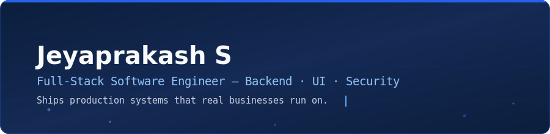

  

 

 

## 👤 Who I Am

I'm the engineer who ends up owning the module nobody else wants to touch — the one where a bug means someone gets paid wrong. On a live RFID-based HRMS platform, I've carried major systems from schema to shipped feature: payroll, reimbursements, attendance, and financial reporting, all handling real money and real employees in production.

I sit at an intersection most developers don't: I write backend logic that has to be *provably correct*, design interfaces that have to be *provably usable*, and increasingly, think about how systems fail from a **security** angle before someone else finds out the hard way.

<table>
<tr>
<td width="33%" valign="top">

**🏗️ Systems Engineer**
Own features end-to-end — data model, API, business logic, and the UI on top of it. Comfortable being the last line of defense on financial-integrity bugs.

</td>
<td width="33%" valign="top">

**🎨 Design-Literate**
Think in component systems and visual hierarchy, not just endpoints. Ship interfaces that hold up to real users, not just demos.

</td>
<td width="33%" valign="top">

**🔐 Security-Minded**
Actively building AppSec and bug-bounty skills. I ask "how does this break" before I ask "does this work."

</td>
</tr>
</table>

- 🎯 **Seeking:** Full-time Software Engineer / Full-Stack Developer roles — startups, product companies, high-ownership teams
- 🤖 Ship AI-powered products independently, end-to-end, from idea to deployed SaaS

---

## 🛠 Tech Stack

**Languages**

**Frontend & Design**

**Backend**

**Database & ORM**

**DevOps & Tools**

**Currently Deepening**

---

## 💼 Production Impact

**RFID-Based HRMS / Workforce Management Platform** — *NestJS · Prisma · PostgreSQL · Next.js · React · Tailwind (TypeScript monorepo)*

A live system handling attendance, payroll, reimbursements, and leave for real employees — where a bug doesn't throw a 500, it pays someone the wrong amount. I own major parts of it end-to-end.

| Problem | What I Did | Why It Mattered |
|---|---|---|
| Payroll reports were double-counting reimbursements against salary cost | Designed a **department-level financial reporting system** with consolidated cost reports, tracing and fixing the root double-counting bug | Financial reports now reflect true cost — the kind of bug that silently corrupts every report downstream if missed |
| Payroll could be triggered twice under race conditions | Built a **transaction-wrapped, hardened double-payment guard** | Closed a real risk of employees being paid twice |
| Reimbursement payments had no traceability | Built a full **payment tracking system** — payment method, timestamp, processor — plus multi-bill attachments and audit trail | Finance now has a verifiable trail for every reimbursement, not just a status flag |
| Employee portal felt dated and inconsistent | Rebuilt it with **reusable component primitives** (`FieldCell`, `ProfileCard`), sensitive-field reveal-on-demand, and a modern hero layout | Turned a legacy screen into a polished, on-brand experience without a full rewrite |
| Dev team kept hitting broken migrations across Windows/Linux | Diagnosed recurring **Prisma migration drift** and shipped a line-ending fix to prevent recurrence | Removed a recurring blocker for the whole engineering team, not just myself |
| RFID card flows and payroll terminology were inconsistent across the admin UI | Audited and standardized **card lifecycle UX** and payroll terminology (Gross → Deductions → Payout → Reimbursement → Net) | Reduced admin confusion and support overhead across the platform |

---

## 🚀 Independent Projects
*Built solo, end-to-end — product thinking, not just code.*

### 🎨 DreamRender — AI Image Generation SaaS
A full SaaS product, not a wrapper script: users sign up, pay, and generate images against a credit system I built and metered myself.

**Stack:** React · Node.js · MongoDB · Clipdrop API
**Highlights:** JWT authentication · Credit-based usage metering · Cloudinary integration · Stripe payments (test mode) · Responsive dashboard

🔗 [Live Demo](http://dreamrender-bx3hjg43g-jeyaprakashtechs-projects.vercel.app/) · [Repository](https://github.com/Jeyaprakashtech/DreamRender)

---

### 🎙️ HINATA — AI Voice Assistant
A browser-based voice assistant with real-time speech-to-text and text-to-speech, built to explore natural voice interaction end-to-end — not just calling an API, but designing the command pipeline behind it.

**Stack:** Python backend · Web Speech APIs
**Highlights:** Speech recognition · Text-to-speech · Voice command handling · Responsive interface

🔗 [Repository](https://github.com/Jeyaprakashtech/Hinata-AI-Voice-Assistant)

---

## 📊 Live GitHub Activity

*Self-hosted, not a third-party widget — this card is generated fresh every day by a GitHub Action in this repo and committed straight into it, so it never shows zeros from someone else's rate limit again.*

  

---

## 🌱 What I'm Learning Next

System Design · Docker · CI/CD Pipelines · Cloud Infrastructure · Application Security & Bug Bounty Hunting

---

## 📫 Let's Connect

- **Portfolio:** [jeyaprakash-portfolio-three.vercel.app](https://jeyaprakash-portfolio-three.vercel.app/)
- **LinkedIn:** [linkedin.com/in/jeyaprakash-s-dev](https://linkedin.com/in/jeyaprakash-s-dev)
- **Email:** [jeyaprakash2630@email.com](mailto:jeyaprakash2630@email.com)

*Open to full-time Software Engineer / Full-Stack Developer roles — let's talk.*

